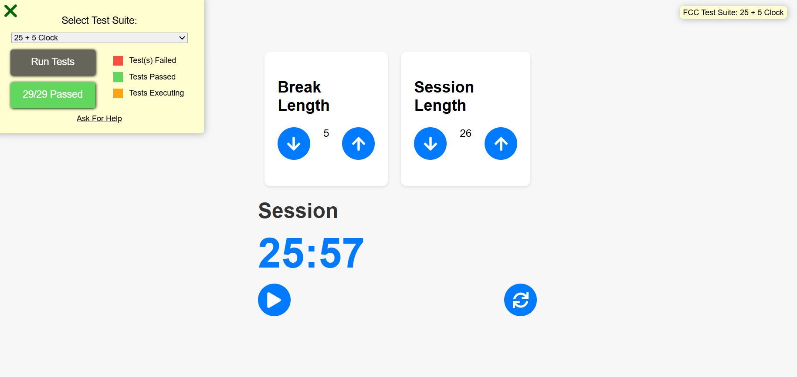

# React Pomodoro Timer ⏲️

## Description 📜

The React Pomodoro Timer is a web application that implements the Pomodoro Technique to help users manage their time more effectively. This technique divides work into intervals, typically 25 minutes of focused work followed by a 5-minute break. The app helps users stay productive by providing visual cues and managing session timing.

The project replicates the functionality of the 25 + 5 Clock as specified by freeCodeCamp, and it is built using React. It includes all required user stories and features to meet the project specifications.

## Technologies Used 💡
- **Frontend**: React
- **State Management**: Redux
- **Styling**: CSS
- **Testing**: FreeCodeCamp's test suite (CDN)

## Demo 📸

 
 [Live-link](https://25-5-clock-i0ms11bqt-sodabaraufs-projects.vercel.app/)

## Features 🎉
- **Adjustable Lengths**: Custom durations for work sessions and breaks.
- **Countdown Timer**: Displays remaining time in mm:ss format.
- **Start/Stop & Reset**: Controls to start, stop, and reset the timer.
- **Automatic Switching**: Switches between sessions and breaks.
- **Audio Alerts**: Beep sound alerts when the timer reaches zero.

## How to Run the Project
1. Clone the repository to your local machine.
2. Install the dependencies by running `npm install` or `yarn install`.
3. Start the development server by running `npm start` or `yarn start`.
4. Open your web browser and navigate to `http://localhost:3000` to view the Markdown previewer.

## Testing
All the required user stories and tests have been successfully completed and passed.

## Acknowledgments 📝
This project was built as part of the FreeCodeCamp curriculum. The project requirements and the provided Markdown previewer example were sourced from the FreeCodeCamp website.

## Author 👩‍💻
- LinkedIn: [Sodaba Rauf](https://www.linkedin.com/in/sodaba-r-5a0733255/)
- Email: [email](sodabarauf4@gmail.com)

## Contributing 🤝

Contributions are welcome! If you'd like to contribute, please fork the repository and create a pull request. Ensure that your code follows the project's coding standards and guidelines.